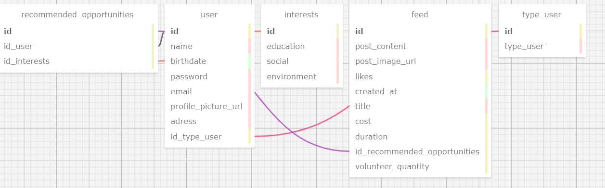

### Modelo relacional 

&nbsp;&nbsp;&nbsp;&nbsp; Com a criação desse modelo relacional do banco de dados, é possível compreender a estrutura do banco de dados, as entidades envolvidas e como elas se relacionam entre si para atender às necessidades do sistema.

<div align="center" width="100%">
 <sub>Banco de dados relacional</sub><br>
 
 
<sup>Fonte: Material produzido pelos autor (2024)</sup>
</div>


&nbsp;&nbsp;&nbsp;&nbsp; Durante o processo, foi utilizada a ferramenta SQLDesigner, disponível nesse [link](https://sql.toad.cz/) e, através do código XML diposto [aqui](./documentos/tabela.xml), faz-se possível a visualização do modelo dentro da plataforma.

&nbsp;&nbsp;&nbsp;&nbsp; Está abaixo posicionada a descrição de cada tabela presente para maior compreensão do banco de dados relacional desenvolvido:

<div align="center">
<sub>Tabela de bancos de dados relacional </sub>
</div>

| tabela                        | descrição                                                                                                                                                                                                                                                                   |
| ----------------------------- | --------------------------------------------------------------------------------------------------------------------------------------------------------------------------------------------------------------------------------------------------------------------------- |
| user                         | Essa tabela armazena os dados relacionados aos usuários do sistema. Isso inclui informações como nome, email, senha e quaisquer outros detalhes específicos do usuário que sejam relevantes para a plataforma. Cada registro nesta tabela representa um usuário individual. |
| type_user                    | Essa tabela define as diferentes classificações de usuários no sistema, distinguindo entre voluntários e organizações não governamentais (ONGs). Cada registro nesta tabela identifica o tipo de usuário ao qual um determinado registro na tabela "user" pertence.        |
| interests | Aqui são registrados os interesses específicos do público-alvo para os quais os usuários direcionam suas atividades voluntárias. Isso pode incluir categorias como social, educação e meio-ambiente.                                  |
| recommended_opportunities                 | Essa tabela combina as informações da tabela user com a tabela de interests para gerar as melhores oportunidades/posts dependendo do endereço e interesse do voluntário                                     |
| feed      | Essa tabela armazena os dados relacionados às publicações feitas no feed da plataforma e nas comunidades. Isso inclui informações como o texto da postagem, data e hora da publicação, imagem, título, duração do ação, quantidade de voluntários que participaram e também referencia a tabela recommended_opportunities para a melhor postagem apareça no feed do voluntário.                                                   |

<div align="center">
<sup>Fonte: Material produzido pelos autor (2024)</sup>
</div>

### Modelo lógico 

&nbsp;&nbsp;&nbsp;&nbsp; Para facilitar a compreensão, apresento um esquema SQL que ilustra a estrutura do banco de dados adotada em toda a aplicação. O ambiente selecionado para este propósito é o PostgreSQL, e a administração dos dados é realizada por meio da plataforma DBeaver.

&nbsp;&nbsp;&nbsp;&nbsp; Este esquema abrange tabelas responsáveis pelo armazenamento e referenciamento de informações essenciais, como informações de usuário, tipos de usuários, interesses, conteúdo do feed e posts/oportunidades recomendadas.

&nbsp;&nbsp;&nbsp;&nbsp; A manipulação e criação de elementos no banco de dados são realizadas seguindo o método CRUD, uma sigla que representa as operações fundamentais em bancos de dados relacionais: Criar (Create), Ler (Read), Atualizar (Update) e Excluir (Delete). Essas operações permitem a manipulação de registros em uma tabela de banco de dados. No momento, os comandos disponíveis são exclusivamente para a criação das tabelas mencionadas.

```sql
CREATE TABLE type_user (
    id SERIAL PRIMARY KEY,
    type_user BOOLEAN NOT NULL
);

CREATE TABLE interests (
    id SERIAL PRIMARY KEY,
    education BOOLEAN NOT NULL,
    social BOOLEAN NOT NULL,
    environment BOOLEAN NOT NULL
);

CREATE TABLE "user" (
    id SERIAL PRIMARY KEY,
    name VARCHAR(20) NOT NULL,
    birthdate DATE,
    password VARCHAR(8) NOT NULL,
    email VARCHAR(20) NOT NULL,
    profile_picture_url VARCHAR NOT NULL,
    adress VARCHAR NOT NULL,
    id_type_user INTEGER,
    FOREIGN KEY (id_type_user) REFERENCES type_user (id)
);

CREATE TABLE recommended_opportunities (
    id SERIAL PRIMARY KEY,
    id_user INTEGER,
    id_interests INTEGER,
    FOREIGN KEY (id_user) REFERENCES "user" (id),
    FOREIGN KEY (id_interests) REFERENCES interests (id)
);

CREATE TABLE feed (
    id SERIAL PRIMARY KEY,
    post_content VARCHAR NOT NULL,
    post_image_url VARCHAR NOT NULL,
    likes INTEGER,
    created_at TIME,
    title VARCHAR,
    cost DECIMAL,
    duration DECIMAL,
    id_recommended_opportunities INTEGER,
    volunteer_quantity DECIMAL,
    FOREIGN KEY (id_recommended_opportunities) REFERENCES recommended_opportunities (id)
);
```